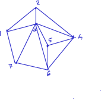

1. For the graph below, write the adjacency matrix:

   * How many paths of length 4 are there between vertex 1 and vertex 4?
   * How many triangles are there in the graph?  
   
   Triangles in a graph are very important in understanding its
   structure. In fact, counting triangles in large graphs, like the
   Internet or Social Media graphs, is an area of active interest. It
   is also used as a basic ingredient in counting subgraphs of many
   kinds, or motifs, which in turn is an essential component of
   understanding graphs that occur in biology and medicine (gene
   networks, protein networks), social media, and more.
